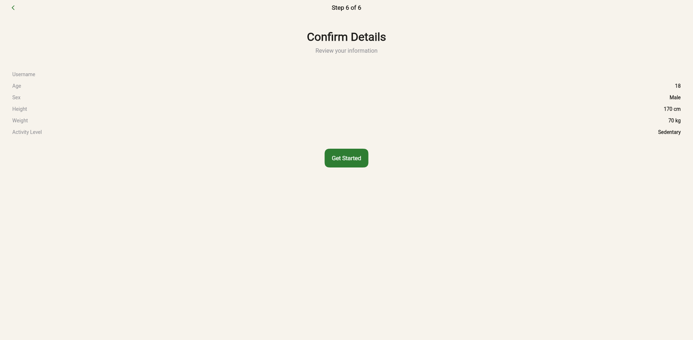
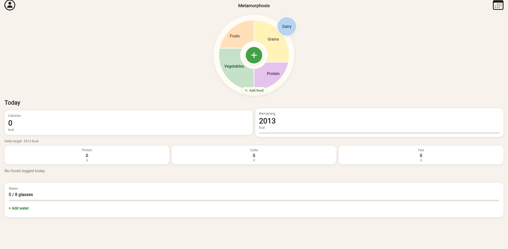
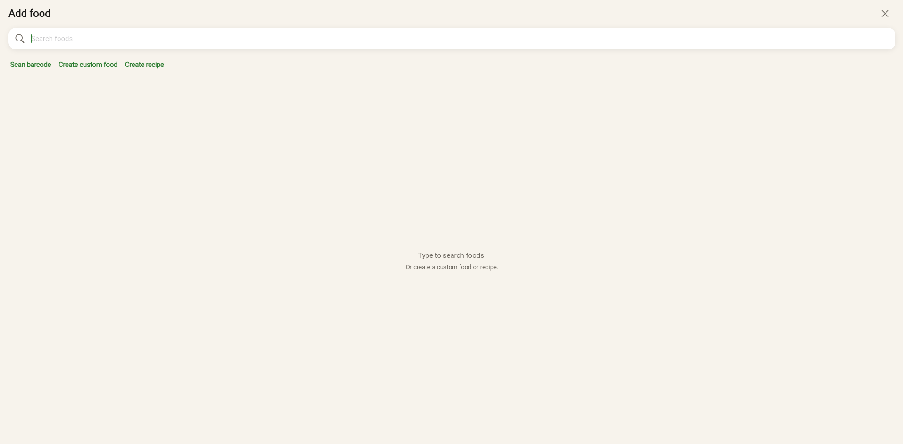
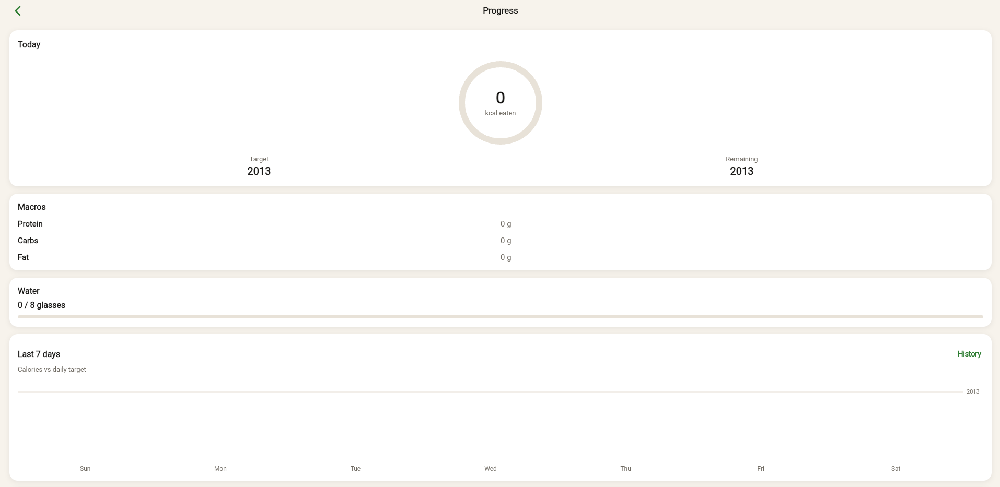

# Metamorphosis

Metamorphosis is a nutrition tracking app designed to make it easier to understand and manage daily nutrition.

## Features

- User onboarding and nutrition profile
- Food search and food logging
- Barcode scanning for packaged foods
- USDA food database integration
- Daily nutrition tracking
- Favorites and saved foods
- Nutrition history and progress tracking
- Firebase-backed data and authentication
- Responsive Flutter web interface

## Tech Stack

- **Flutter / Dart** — application development
- **Firebase** — authentication, backend services, and hosting
- **USDA FoodData Central** — nutrition data
- **ZXing** — web barcode detection
- **Flutter Web** — browser-based deployment

## Live Demo

[Metamorphosis](https://metamorphosis-66fd1.web.app)

## Project

Metamorphosis was developed as a full-stack application project, combining a Flutter frontend with cloud services and external nutrition data.

The project focuses on making nutrition information accessible through a simple workflow: create a profile, find or scan foods, log meals, and review nutrition information over time.

## Status

The application is currently deployed and functional.

## Status

The application is currently deployed and functional.

## Screenshots

### Profile Setup

### Nutrition Dashboard

### Food Search & Logging

### Progress
